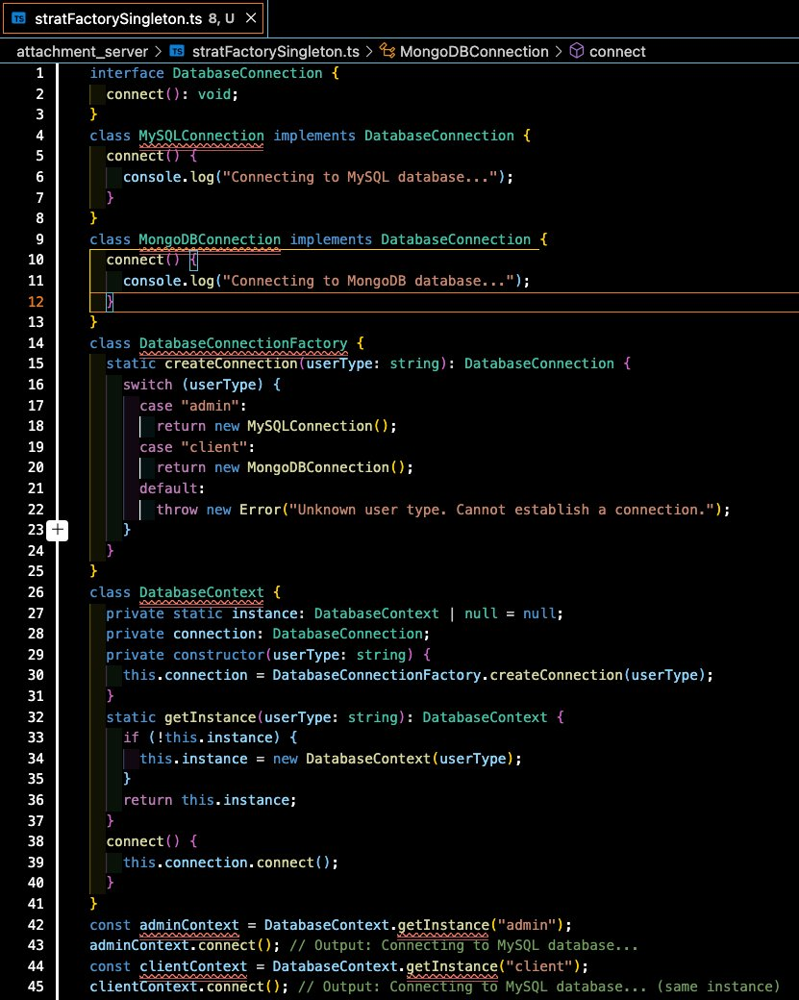
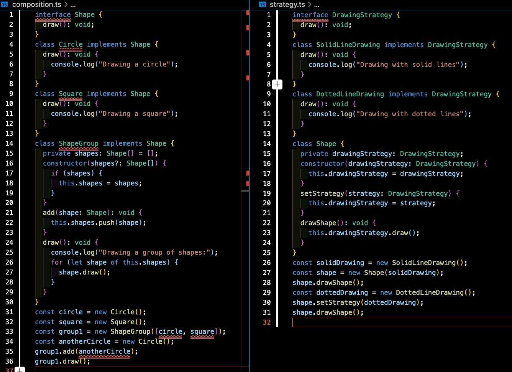
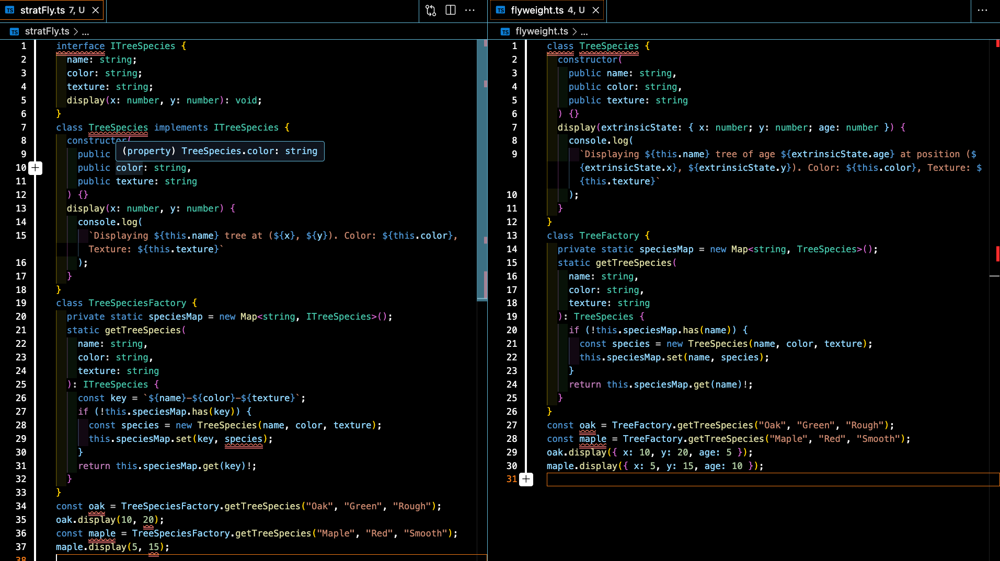

# Gang of 4 TL;DR

## Summary:

- [Creation](#creation) is the construction of objects from classes.
- [Structure](#structure) is the composition of those constructed objects from classes.
- [Behavior](#behavior) is the behavior mechanisms of those composed classes in a program.

### Creation

1. Abstract Factory - what
2. Builder - concrete impl with extra steps
3. Factory Method - function extraction
4. Prototype - built into js
5. Singleton - makes the constructor private with a public method to access the unique instance 

### Structure

1. Adapter - inject dependency of one class implementation of an interface into another class which implements another interface
2. Bridge - garbage for inheritance; use strategy
3. Composite - same as strat but immutable methods in task class 
4. Decorator - a multistep form of dependency injection
5. Facade - combines multiple concrete implementations and composes (a) method(s) comprising extracted class methods
6. Flyweight - a garbage version of strategy 
7. Proxy - a wrapper around the class which adds members (properties and methods)

### Behavior

1. Chain of Responsibility - strategy with extra steps that works less efficiently to do the same thing as the actor model (comms between objects)
2. Command - strategy with extra steps
3. Interpreter - another strategy pattern
4. Iterator - built in js type (for loop)
5. Mediator - actor model but centralized
6. Memento - keeps a history array of objects (eg for time travel debugging)
7. Observer - used with singleton pattern for maintaining an array of callbacks to update subscribers (eg RxJS)
8. State - strategy pattern where the class is hard coded in the constructor
9. Strategy - implements an interface via dependency injection with various concrete implementations usually accompanied by a factory class with static generator
10. Template Method strategy with facade
11. Visitor - delegates method calls to a passed in object (dependency injection)
